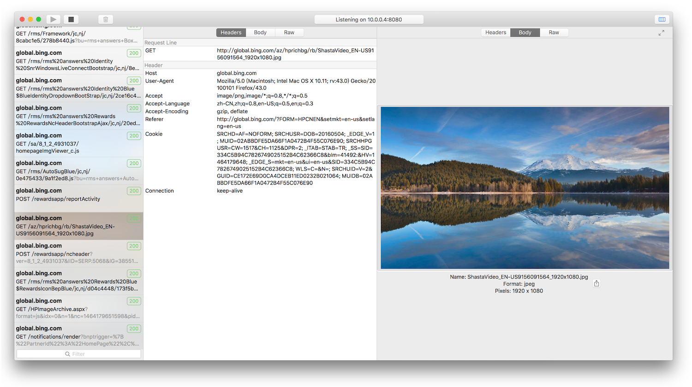

# Captor

Captor is an HTTP protocol analyzer. It capture and decode HTTP and HTTPS traffic, make it simple for developers to debug.

 

### How to work
Captor captures HTTP/HTTPS traffic between chosen devices  and the Internet, It allows you to analyze incoming and outgoing data to monitor requests and responses before they hit the browser.

### Key features

* HTTPS traffic analyse (Needs to install captor certificate to decrypt HTTPS traffic, [**Install Guide**](/installguide))
2. RESTful debugging, view JSON and XML request and response in tree view or text view
3. Filtering Support for session list
4. Capturing traffic on any platform (iOS, MacOS, Android, Windows etc.)
5. Optimization for OS X，native and easy to use
6. Support HTTP1.0 and HTTP1.1

### Documents
* [Install Captor root certificate to device](/installguide)

### Support or Contact
Any questions, contact us <captorio.help@gmail.com> and we’ll help you sort it out.
